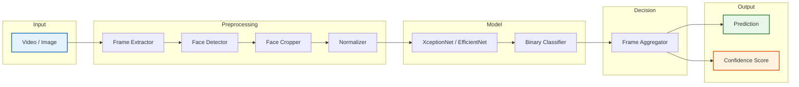

# System Architecture

## Overview

The deepfake detection system follows a clean, linear pipeline architecture. Each stage transforms data until a final **Real** or **Fake** prediction is produced.

## Architecture Diagram



## Pipeline Stages

### 1. Input
| Component | Description |
|-----------|-------------|
| Video | MP4 files from social media (any resolution) |
| Image | Single face images (JPG/PNG) |

### 2. Preprocessing
| Stage | Input | Output | Tool |
|-------|-------|--------|------|
| Frame Extractor | Video | RGB frames | OpenCV |
| Face Detector | RGB frame | Bounding boxes | MTCNN |
| Face Cropper | Frame + boxes | Cropped faces | OpenCV |
| Normalizer | Cropped faces | 299×299 tensors | torchvision |

### 3. Model
| Component | Parameters | Purpose |
|-----------|-----------|---------|
| XceptionNet | 22.9M | Primary feature extractor |
| EfficientNet-B0 | 5.3M | Lightweight alternative |
| Binary Classifier | 1K | Real/Fake decision |

### 4. Decision
| Aggregator | Method | Use Case |
|------------|--------|----------|
| Mean | Average all frames | Balanced videos |
| Majority Vote | Most common prediction | Noisy videos |
| Confidence Weighted | Weight by confidence | High-certainty frames |

### 5. Output
| Output | Format | Description |
|--------|--------|-------------|
| Prediction | `real` / `fake` | Final classification |
| Confidence | 0.0 – 1.0 | Model certainty |

## Directory Structure

```
deepfake-social-media-detector/
├── src/
│   ├── config/            # Settings, paths, constants
│   ├── data/              # Download, organize, split
│   ├── preprocessing/     # Frames, detection, cropping
│   ├── models/            # XceptionNet, EfficientNet
│   ├── training/          # Loop, losses, metrics
│   ├── evaluation/        # Confusion matrix, ROC, reports
│   ├── inference/         # Video/image prediction
│   ├── visualization/     # Plots, GradCAM
│   ├── api/               # FastAPI service
│   └── utils/             # Logger, seed, helpers
├── configs/               # YAML configurations
├── datasets/              # Raw data + metadata
├── outputs/               # Models, reports, plots
├── tests/                 # Unit tests
├── scripts/               # Setup, train, evaluate
└── notebooks/             # Analysis notebooks
```

## Tech Stack

| Layer | Technology | Why |
|-------|-----------|-----|
| Deep Learning | PyTorch 2.0+ | Industry standard, GPU support |
| Face Detection | MTCNN | Real-time, accurate |
| API | FastAPI | Async, auto-docs, fast |
| Visualization | Matplotlib | Publication quality |
| Config | YAML | Human readable |
| Testing | pytest | Simple, powerful |
